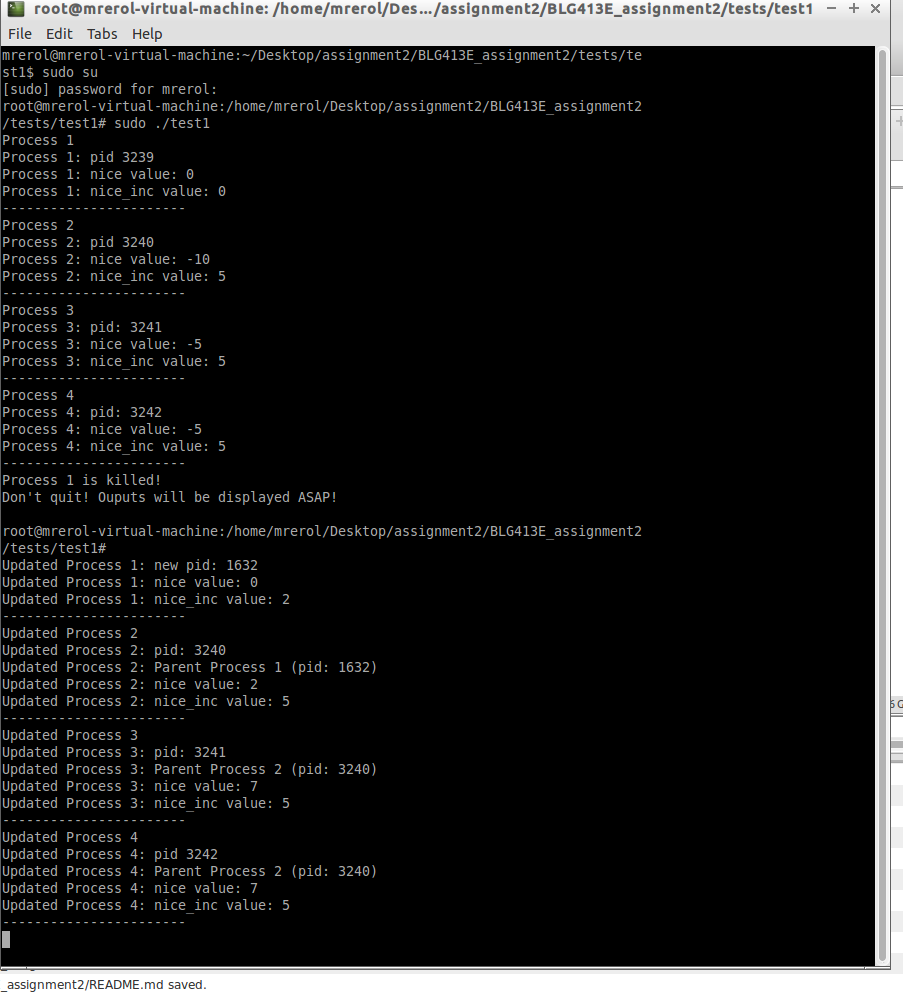
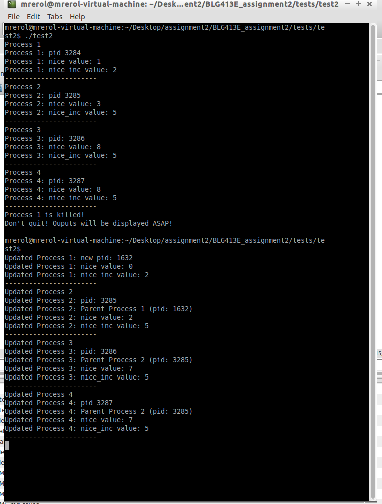

# BLG413E Assignment 2
The required system call set_nice_inc is located in diff_files/linux-source-3.13.0/mycalls/ directory. Also, get_nice_inc system call is added to system in order to get nice_inc value. It is also located in the same place with set_nice_inc.
In the project, modified parts are explained below. In the fork.c and exit.c files, searching as "my modification" gives you modified parts. Also, the all modified files are listed with "diff" command into "diff.txt" file.
## Name: Muhammed Raşit EROL
## S. Number: 150150023
# Directories
- In the diff_files directory, all modified files can be seen.
- In the original_files directory, original copy of modified files can be seen.
- In the test directory, test codes can be seen.

# Tests
- Test 1 (test1.c) must be run with root privilages. The scenario of that test is coming from project pdf.
- Test 2 (test2.c) can be run without root privilages. The scenario of that test is like test1 but with positive nice values.

# Modified Parts
## init_task.h
Directory: diff_files/linux-source-3.13.0/include/linux/init_task.h
Modified line numbers : 165
```c
#define INIT_TASK(tsk)	
{									
	.state		= 0,						
	.nice_inc 	= 0,						
	.stack		= &init_thread_info,				
	...
}
```
## sched.h
Directory: diff_files/linux-source-3.13.0/include/linux/sched.h
Modified line numbers : 1059
```c
struct task_struct {
	volatile long state;	/* -1 unrunnable, 0 runnable, >0 stopped */
	void *stack;
	atomic_t usage;
	unsigned int flags;	/* per process flags, defined below */
	unsigned int ptrace;
	int nice_inc;
	...
}
```
## syscalls.h
Directory: diff_files/linux-source-3.13.0/include/linux/syscalls.h
Modified line numbers : 852-853
```c
...
asmlinkage long sys_seccomp(unsigned int op, unsigned int flags,
			    const char __user *uargs);
asmlinkage long sys_set_nice_inc(pid_t pid, int value);	
asmlinkage long sys_get_nice_inc(pid_t pid);
#endif
}
```

## syscall_32.tbl
Directory: diff_files/linux-source-3.13.0/arch/x86/syscalls/syscall_32.tbl
Modified line numbers : 364-365
```c
...
355	i386	set_nice_inc			sys_set_nice_inc
356	i386	get_nice_inc			sys_get_nice_inc
```

## fork.c
Directory: diff_files/linux-source-3.13.0/kernel/fork.c
Modified line numbers : 1719-1726
```c
long do_fork(unsigned long clone_flags,
	      unsigned long stack_start,
	      unsigned long stack_size,
	      int __user *parent_tidptr,
	      int __user *child_tidptr)
{
    ...
	// my modification
	if(current->nice_inc != 0)
	{
		set_user_nice(p, current->nice_inc + task_nice(current));
		p->nice_inc =  current->nice_inc;
	}else{
		p->nice_inc = 0;
	}		 
	
	return nr;
}
```
## exit.c
Directory: diff_files/linux-source-3.13.0/kernel/exit.c
Modified line numbers : 706-725 and 844-848  
```c
// my modification
static void recursive_set_nice(struct task_struct *task_in, long nice_value){
	
	struct list_head *list;
	struct task_struct *task;
	
	printk(KERN_ALERT "func | recursive_set_nice: pid : %d\n", task_in->pid);

	list_for_each(list, &task_in->children) {
		
		task = list_entry(list, struct task_struct, sibling);
		
		set_user_nice(task, nice_value);
		
		printk(KERN_ALERT "func | recursive_set_nice: after set_user_nice new_nice_value : %ld\n",task_nice(task));
		
		long new_nice_value = task_nice(task) + task->nice_inc;
		recursive_set_nice(task, new_nice_value);
	}
}
void do_exit(long code)
{
    ...
	//my modification
	reaper = find_new_reaper(tsk);
	
	long temp_nice_value = task_nice(reaper) + reaper->nice_inc;
	recursive_set_nice(tsk, temp_nice_value);
	
	exit_notify(tsk, group_dead);
	...
```
## Makefile
Directory: diff_files/linux-source-3.13.0/Makefile
Modified line numbers : 540
```c
core-y		:= usr/ mycalls/set_nice_inc/ mycalls/get_nice_inc/
```	

## get_nice_inc.c and set_nice_inc.c
Directory: diff_files/linux-source-3.13.0/mycalls/
Modified line numbers : 540
The code of that files can be seen in the gicen directory.

# Screenshots 
The screenshots of the test can be seen below.
## Test 1
 
## Test 2
  
